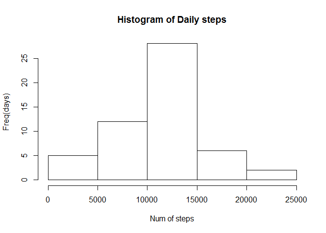
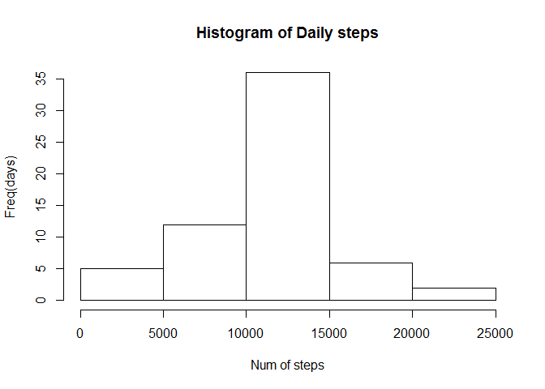

# Reproducible Research: Peer Assessment 1


##Loading and pre-processing the data: Getting the right packages

```r
library(sqldf)
```

```
## Loading required package: gsubfn
```

```
## Loading required package: proto
```

```
## Loading required package: RSQLite
```

```
## Loading required package: DBI
```

```r
library(plyr)
library(ggplot2)
library(dplyr)
```

```
## 
## Attaching package: 'dplyr'
```

```
## The following objects are masked from 'package:plyr':
## 
##     arrange, count, desc, failwith, id, mutate, rename, summarise,
##     summarize
```

```
## The following objects are masked from 'package:stats':
## 
##     filter, lag
```

```
## The following objects are masked from 'package:base':
## 
##     intersect, setdiff, setequal, union
```
###Setting up the right working directory and importing all the packages. Removed "NA" and converted date as date.

```r
setwd("D:/Coursera/Data Scientist/Reproducilble research/Week-1/Data")
activity<- read.csv("activity.csv")
activity1<-na.omit(activity)
activity1$date<-as.Date(activity1$date, "%Y-%m-%d")
```
## What is mean total number of steps taken per day? 
###Here used the sql approach. Grouped by date to calculate the sum. The histogram shows that there are more days where people walk anywhere between 10000 to 15000 steps.

```
## Loading required package: tcltk
```

\


## What is the average daily activity pattern? 


```r
StepsPer5min<-summarise(group_by(activity1,interval), steps=mean(steps))
g<-ggplot(StepsPer5min, aes(interval,steps))
print(g+ geom_line())
```

\
### the graph indicate that person takes maximum steps on an average at the 800+ interval
###following Code calculated the sum, mean and median for each day.
### It indicate that the average steps taken and the median

```
## [1] 37.3826
```

```
## [1] 0
```

## Imputing missing values
### for imputing the missing values I calculate the mean across each 5 min interval

```r
StepsPer5min<-summarise(group_by(activity1,interval), steps=mean(steps))
```
### then I join this data set based on the interval key back to the original 'unclean(no NA removed) data set

```r
activity2<-sqldf('select a.steps, a.date, a.interval, b.steps as avgstps from activity as a, StepsPer5min as b where a.interval = b.interval')
```
### This helps me with aligning the interval mean against the original dataset
### I then use a simple for and if loop to update the missing values with mean where ever necessary

```r
for(i in 1:length(activity2$steps))
  {
  if(is.na(activity2[i,1]))
    {
    activity2[i,1]<-activity2[i,4]
    }

  }
```
### After the values are imputed we do get more observation 61 days instead of 53.

```r
dailysteps_total1<-sqldf('select sum(steps) as totaldlystps, date as date from activity2  group by date' )
hist(dailysteps_total1$totaldlystps, main="Histogram of Daily steps", xlab = "Num of steps", ylab ="Freq(days)" )
```

\
### The above histogram(post imputing the data shows that we now have more number of days(35 compared to 25) where the subject has taken between 10000 and 15000 steps.
## Are there differences in activity patterns between weekdays and weekends?
